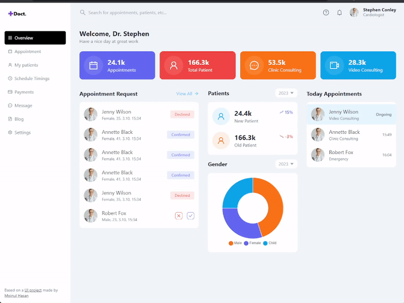

# Medical Dashboard
<p align="center">
   
</p>

## About the project
The dashboard was made to experiment with Framer Motion and to transform Figma design into a working website. Additionally, a package with icons was incorporated during the process. The website is one-page and has no back-end functionalities.

## Installation
1. Clone the repo
   ```sh
   git clone https://github.com/dev-kamil/medical-dashboard
   ```
2. Install NPM packages
   ```sh
   npm install
   ```
3. Run application
   ```sh
   npm run dev
   ```
   Done! :smile:
